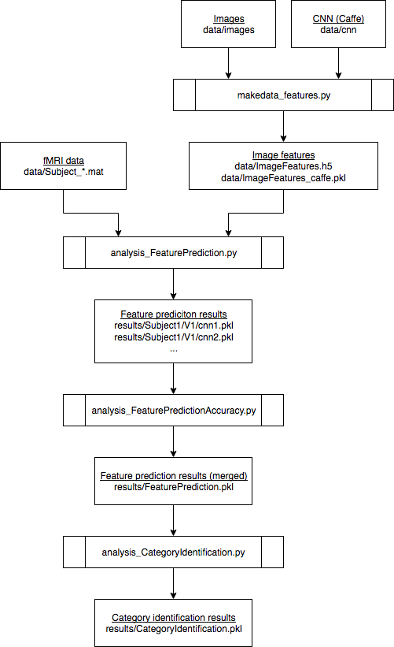

# Generic Decoding Demo/Python

This is Python code for Generic Decoding Demo.

## Requirements

All scripts are tested with Python 2.7.13.
The following packages are required.

- bdpy
- numpy
- scipy
- pandas
- scikit-learn
- matplotlib (mandatory for creating figures)
- caffe (mandatory if you calculate image and category features by yourself)
- PIL (mandatory if you calculate image and category features by yourself)

`bdpy` is an in-house library and will be publicly available soon.

## Data organization

All data should be placed in `python/data`.
Data can be obrained from <http://brainliner.jp/data/brainliner/Generic_Object_Decoding>.
The data directory should have the following files:

    data/ --+-- Subject1.mat (fMRI data, subject 1)
            |
            +-- Subject2.mat (fMRI data, subject 2)
            |
            +-- Subject3.mat (fMRI data, subject 3)
            |
            +-- Subject4.mat (fMRI data, subject 4)
            |
            +-- Subject5.mat (fMRI data, subject 5)
            |
            +-- ImageFeatures.h5 (image features extracted with Matconvnet)
            |
            +-- ImageFeatures_caffe.pkl (image features extracted with Caffe)
            |
            +-- images/ (training and test images)
            |
            +-- cnn/ (Caffe CNN related data)

Either `ImageFeatures.h5` or `ImageFeatures_caffe.pkl` is necessary for the analysis.
`images` and `cnn` are required if you calculate image feature by yourself.

## Script files

- **analysis_FeaturePrediction.py**: Run image feature prediction for each subject, ROI, and layer (feature).
- **analysis_FeaturePredictionAccuracy.py**: Merge outputs of analysis_FeaturePrediction.py and calculate feature prediction accuracy.
- **analysis_CategoryIdentification.py**: Run category identification.
- **createfigure.py**: Create result figures.
- **makedata_features.py**: Calculate CNN image features with Caffe.
- **gd_parameters.py**: Common analysis parameter settings. This module is called in analysis_* scripts.
- **gd_features.py**: Image feature class. This class is called in analysis_* scripts.
- **gd_cnn.py**: CNN class. This is called in makedata_features.py

## Analysis

### Quick guide

    $ python analysis_FeaturePrediction.py
    $ python analysis_FeaturePredictionAccuracy.py
    $ python analysis_CategoryIdentification.py
    $ python createfigure.py
